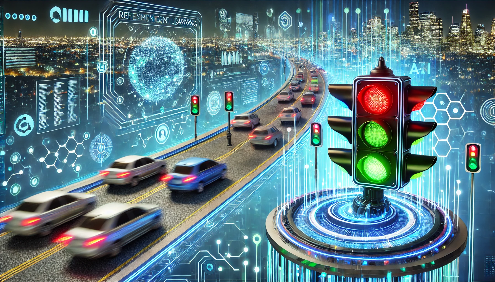

# 🚦 Traffic Control with AI


This project analyzes and compares the effectiveness of three Reinforcement Learning (RL) algorithms: **Deep Q-Learning, Q-Learning, and SARSA**, applied to traffic light management to reduce congestion at a simulated intersection.

The algorithms were evaluated against each other, a fixed-phase traffic light, and a traffic light that dynamically changed its state based on vehicle queues. The simulation was conducted using a Python-based intersection map sourced online and modified to fit the experiments.

The results demonstrate that **Deep Q-Learning** is the most effective approach, significantly improving the average vehicle waiting time compared to other implemented methods.

---

## 🚀 Installation

### 1. Clone the repository

```sh
git clone https://github.com/yourusername/Traffic_control.git
cd Traffic_control
```

### 2. Install dependencies

- **Using `requirements.txt`:**

```sh
pip install -r requirements.txt
```

- **Using Anaconda:**

```sh
conda create --name traffic_control --file requirements.txt
conda activate traffic_control
```

---

## 🏗️ Usage

This project includes two main scripts for training and evaluating the RL algorithms applied to traffic control.

### 1️⃣ Train a Model

To train a model, run:

```sh
python main2.py
```

A menu will appear, allowing you to select which algorithm to train:

```
Select an agent to train:
1 Q-Learning Agent
2 Deep Q-Learning Agent
3 SARSA
```

- **Q-Learning** → Enter `1`
- **Deep Q-Learning** → Enter `2`
- **SARSA** → Enter `3`

Each algorithm is trained for **1000 episodes**, and the results are saved for further evaluation.

---

### 2️⃣ Evaluate Trained Models

To evaluate and compare the trained models, run:

```sh
python main3.py
```

You will see the following menu:

```
*** Traffic Light Controller ***
1 Fixed Cycle (FC)
2 Longest Queue First (LQF)
3 Deep Q-Learning
4 Q-Learning
5 SARSA
6 Validate Models
0 Exit
```

#### Available options:

- **Fixed Cycle (FC)** → Evaluates a fixed-phase traffic light.
- **Longest Queue First (LQF)** → Evaluates a traffic light prioritizing the longest queue.
- **Deep Q-Learning** → Loads and evaluates the Deep Q-Learning model.
- **Q-Learning** → Loads and evaluates the Q-Learning model.
- **SARSA** → Loads and evaluates the SARSA model.
- **Validate Models** → Automatically compares all implemented models.
- **Exit** → Exits the program.

For options `1` to `5`, you will be prompted to enter the number of episodes to simulate and whether to visualize the simulation (`yes/no`).

For **option 6 (Validate Models)**, all models are tested in a single execution, displaying results automatically.

---


📊 Performance Summary

Fixed Cycle & Longest Queue First: These models show similar performance, with an average waiting time of 3.56 and 3.54 seconds, respectively, and a collision rate of 0.05. While moderately efficient, they maintain low collision rates, indicating reliability but leaving room for improvement.

Deep Q-Learning: This model stands out with the best overall performance, achieving the lowest average waiting time of 2.99 seconds and a minimal collision rate of 0.01. These results highlight its clear superiority in both efficiency and safety.

Q-Learning: Positioned as a middle-ground option, it achieves an average waiting time of 3.29 seconds and a collision rate of 0.04. Although slightly inferior to Deep Q-Learning, it outperforms Fixed Cycle and Longest Queue First models.

SARSA: The least effective model, with a significantly higher average waiting time of 7.80 seconds and a collision rate of 0.13. It proves less effective in optimizing traffic flow and reducing accidents compared to the other models.


## 👥 Authors & Contact

| Name                | Role & Contact                                                                                       |
|---------------------|---------------------------------------------------------------------------------------------------|
| **Carmela Pia Senatore** | Developer - [GitHub](https://github.com/carmens0) <br> 📧 [Email](mailto:carmensenatore58@gmail.com) <br> 🔗 [LinkedIn](https://linkedin.com/in/carmela-pia-senatore-ba1797207) |
| **Gennaro Capaldo**  | Developer - [GitHub](https://github.com/Gennaroc01) <br> 📧 [Email](mailto:gennaro.capaldo2001@gmail.com) <br> 🔗 [LinkedIn](#) |

---

🔥 *Accelerate traffic flow with AI-driven optimization!* 🚦🤖

